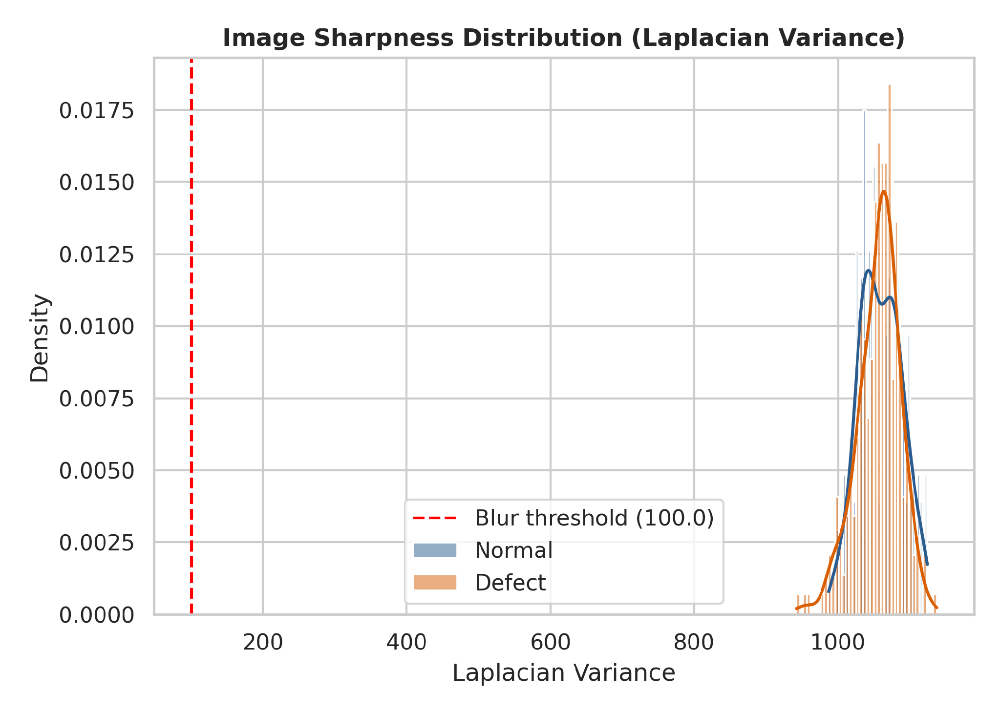
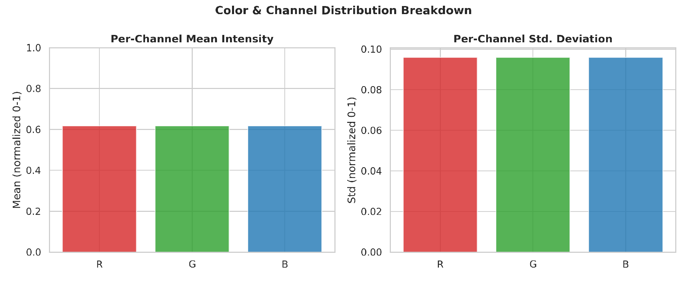
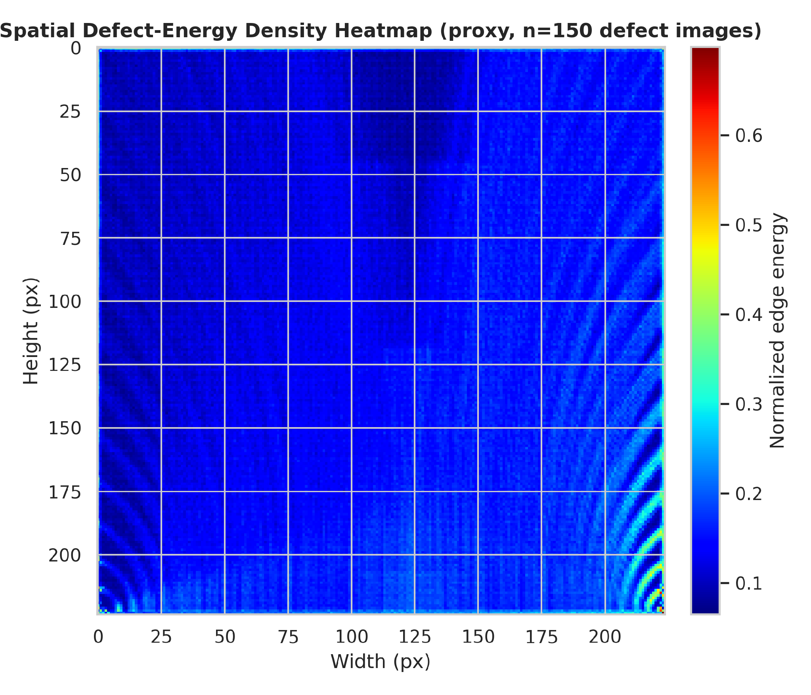
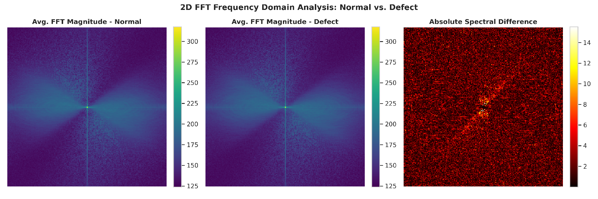
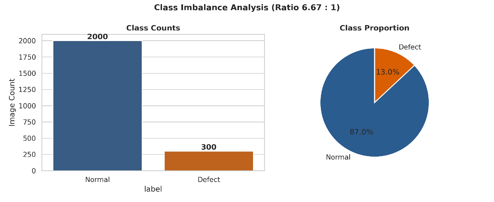
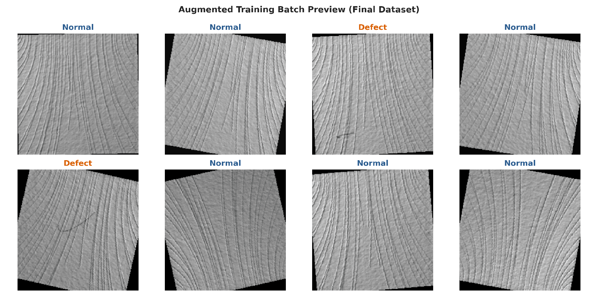
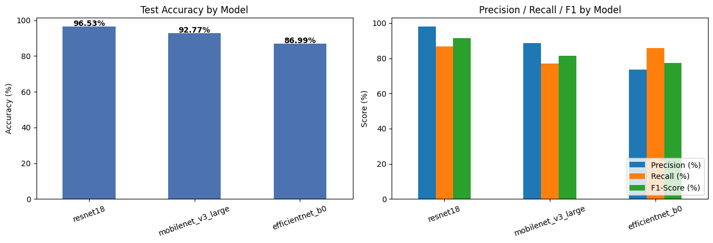
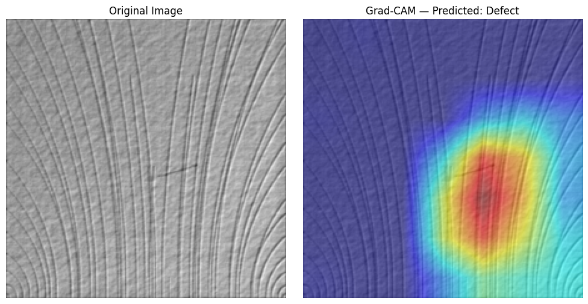
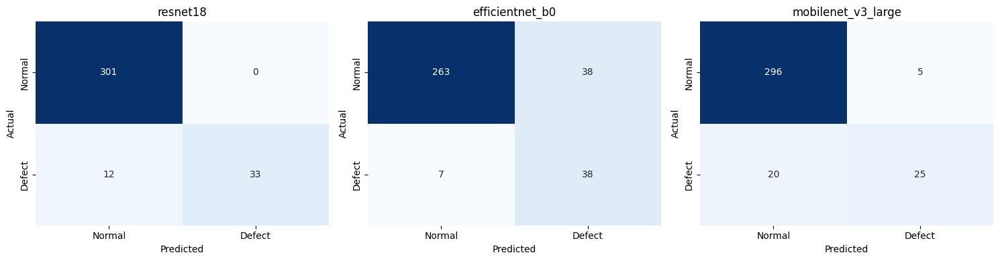
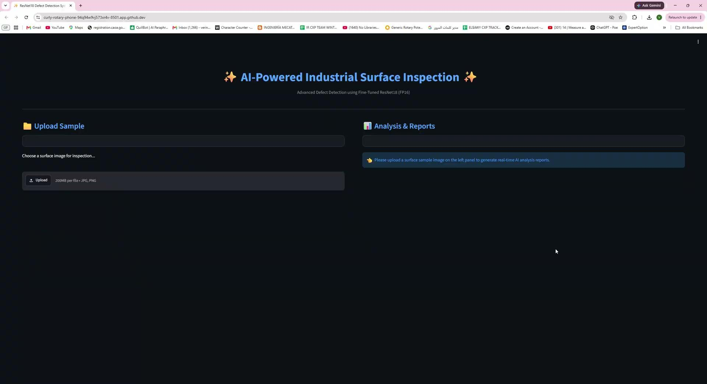

# 🏭 Industrial Surface Defect Detection — Transfer Learning on DAGM 2007


## 📌 Project Overview

An end-to-end **industrial surface defect detection** pipeline built on the **DAGM 2007** dataset, classifying surface images as **Normal** or **Defect**.

The project follows a disciplined, three-phase engineering process rather than jumping straight to a deep model:

```text
Phase 1 — Data Engineering & EDA
     ↓
Phase 2 — Baselines → Transfer Learning (ResNet18)
     ↓
Phase 3 — Interpretability & Threshold Optimization
```

Every design decision (splitting strategy, augmentation, loss function, evaluation metric) is justified by evidence gathered during EDA, not assumed up front.

---

## 🎯 Objective

Surface inspection in manufacturing is a **severe class-imbalance problem**: defects are rare by definition, and a missed defect (false negative) is far costlier than a false alarm. The project's goals were to:

* Build a clean, leak-free data pipeline with a reproducible stratified split.
* Quantify and correct for class imbalance rather than ignore it.
* Establish honest non-deep-learning and from-scratch-CNN baselines before using transfer learning.
* Fine-tune a pretrained backbone (ResNet18) with a two-phase training protocol.
* Explain model predictions (Grad-CAM) instead of treating the model as a black box.
* Tune the decision threshold to minimize missed defects without sacrificing precision.

---

## 📊 Dataset

**DAGM 2007**, *Class10* surface-texture subset.

| | |
|---|---|
| **Total images** | 2,300 |
| **Normal** | 2,000 |
| **Defect** | 300 |
| **Imbalance ratio** | 6.67 : 1 |
| **Input resolution** | 224 × 224 RGB |
| **Labeling rule** | An image is `Defect (1)` only if a matching mask exists at `Label/<image>_label.PNG`; otherwise `Normal (0)` |

### Split strategy

A **stratified 70 / 15 / 15 Train / Val / Test split** (fixed seed = 42) preserves the true 6.67:1 ratio identically across all three sets.

> **Why:** Val and Test must reflect real-world imbalance to give an unbiased performance estimate. Any rebalancing (oversampling, `WeightedRandomSampler`) is applied **only to the Train loader**, never to Val/Test — otherwise the evaluation would leak an artificial class distribution.

---

# 1️⃣ Data Engineering & EDA

`dataset.py` owns dataset discovery, labeling, and the stratified split — the single source of truth used by every other script.

Key EDA findings that shaped downstream decisions:

* **Sharpness audit (Laplacian variance):** 0 blurry/corrupted images flagged — the raw capture pipeline is clean.

  

* **Channel statistics:** dataset-specific mean ≈ 0.617, std ≈ 0.096 (near-grayscale industrial imagery) — used when training a backbone from scratch; ImageNet stats are reserved for fine-tuning an ImageNet-pretrained backbone.

  

* **Spatial defect localization:** no strong positional bias toward center or edges, meaning `RandomHorizontalFlip` / `RandomVerticalFlip` / `RandomRotation` are statistically safe augmentations.

  

* **Frequency-domain (2D FFT) analysis:** defective surfaces show a measurable shift toward high-frequency energy — local discontinuities (scratches, cracks) inject high-frequency content that clean periodic texture does not have.

  

* **Class imbalance confirmed severe** (ratio ≥ 3.0 threshold) at 6.67 : 1 — accuracy alone is a misleading metric at this ratio.

  

### Sample augmented training batch



---

# 2️⃣ Baseline Models

Before reaching for transfer learning, two honest baselines set the floor any deep model must beat.

### Baseline 1 — Classical ML on hand-crafted features

`baseline_model.py` extracts a hand-crafted feature vector per image:

* Downsampled grayscale pixel intensities (32×32, flattened)
* Global statistics: mean, std, min, max, median
* A coarse 16-bin grayscale intensity histogram

...and trains a **Logistic Regression** (`class_weight="balanced"`) classifier on standardized features (scaler fit on train only, to avoid leakage).

### Baseline 2 — SimpleCNN trained from scratch

A lightweight CNN (~406K parameters, Global Average Pooling instead of Flatten) trained with **no pretrained weights**, to isolate how much transfer learning actually helps.

### Actual baseline results (real DAGM run)

| Model | Accuracy | F1 | ROC-AUC | Latency (ms/img) |
|---|---:|---:|---:|---:|
| Logistic Regression | 68.2% | 32.9% | 0.716 | 0.001 |
| Random Forest | 85.8% | 32.9% | 0.712 | 0.102 |
| SimpleCNN (5 epochs) | 87.0% | 23.0% | 0.519 | 9.32 |

**Key finding:** the classical Random Forest baseline outperformed the from-scratch SimpleCNN on nearly every metric — the CNN collapsed under class imbalance (predicting one class for the entire test set across different epochs), the opposite of what's normally expected. This is a strong signal that **naively-trained deep models are not automatically better** without imbalance handling — exactly the problem the transfer-learning phase addresses directly.

---

# 3️⃣ Transfer Learning — ResNet18

`model.py` builds a **ResNet18** backbone (ImageNet-pretrained) with a custom classification head:

```text
Backbone: ResNet18 (ImageNet weights)
Head:     Linear(512 → 128) → ReLU → Dropout(0.3) → Linear(128 → 2)
```

The convolutional backbone transfers low-level texture/edge filters well to industrial surface images even though the source domain (natural images) differs.

### Two-phase training protocol (`train.py`)

| Phase | Backbone State | Epochs | LR | Goal |
|---|---|---:|---:|---|
| **Phase 1 — Feature Extraction** | Frozen | 10 | 1e-4 | Train only the new classifier head |
| **Phase 2 — Fine-Tuning** | Last block unfrozen | 15 | 1e-5 | Adapt deep features to this dataset |

* **Optimizer:** Adam, weight decay 1e-5
* **Scheduler:** `ReduceLROnPlateau` (factor 0.5, patience 3, monitors Val loss)
* **Early stopping:** patience 7 epochs on Val loss, best checkpoint restored automatically
* Training completed the full protocol without triggering early stopping — a good-fit signal, not an underfit/overfit one.

### Final test-set performance (ResNet18)

| Class | Precision | Recall | F1 |
|---|---:|---:|---:|
| Normal | 0.96 | 1.00 | 0.98 |
| Defect | 1.00 | 0.73 | 0.85 |

**Final Test Accuracy: 96.53%**

Defect Precision is a perfect 100% (zero false alarms), but default-threshold Recall (73%) means roughly 1 in 4 real defects were missed — directly addressed by the threshold tuning in Phase 3.

### Context: comparison against other backbones

The wider project (see the technical report and presentation) also benchmarked EfficientNet-B0 and MobileNetV3-Large under the identical protocol:

| Model | Accuracy | Precision | Recall | F1 | Params |
|---|---:|---:|---:|---:|---:|
| **ResNet18** 🏆 | **96.53%** | **98.08%** | 86.67% | **91.33%** | 11.18M |
| MobileNetV3-Large | 92.77% | 88.50% | 76.95% | 81.31% | 4.20M |
| EfficientNet-B0 | 86.99% | 73.70% | 85.91% | 77.46% | 4.01M |

ResNet18 was selected as the production model — best accuracy and precision, with training time comparable to the smaller backbones (~11 minutes each). This repository packages the **ResNet18 pipeline** specifically (`model.py`, `train.py`, `evaluate.py`).



---

# 4️⃣ Interpretability & Error Analysis

* **Grad-CAM** (Gradient-weighted Class Activation Mapping) confirms ResNet18's attention concentrates on the actual scratch/texture irregularity rather than unrelated background — evidence the model learned genuine defect features, important for trust in an industrial QC setting.

  

* **`evaluate.py`** generates a confusion-matrix heatmap and a grid of the top-K most-confidently-wrong predictions, so every misclassified test image can be inspected individually rather than reduced to a single accuracy number.

  

### False Negative / False Positive breakdown (all three backbones)

| Model | Defect Recall | False Negatives | False Positives |
|---|---:|---:|---:|
| EfficientNet-B0 | 84.44% | 7 | 38 |
| ResNet18 | 73.33% | 12 | 0 |
| MobileNetV3-Large | 55.56% | 20 | 5 |

Each model shows a distinct failure mode: EfficientNet-B0 is the most "trigger-happy" (best Recall, worst Precision); ResNet18 is the most conservative (perfect Precision, more missed defects); MobileNetV3-Large is weakest overall.

---

# 5️⃣ Decision Threshold Tuning — ResNet18

Rather than switching architectures, ResNet18's Defect-probability threshold was swept from the default 0.50 down to 0.20:

| Threshold | Accuracy | Precision | Recall | F1 | False Neg. | False Pos. |
|---|---:|---:|---:|---:|---:|---:|
| 0.50 (default) | 96.53% | 100.00% | 73.33% | 84.62% | 12 | 0 |
| 0.45 | 96.82% | 100.00% | 75.56% | 86.08% | 11 | 0 |
| 0.40 | 97.11% | 100.00% | 77.78% | 87.50% | 10 | 0 |
| 0.35 | 97.11% | 100.00% | 77.78% | 87.50% | 10 | 0 |
| 0.30 | 97.69% | 100.00% | 82.22% | 90.24% | 8 | 0 |
| **0.25 (optimal)** | **97.98%** | **100.00%** | **84.44%** | **91.57%** | **7** | **0** |
| 0.20 | 97.11% | 92.68% | 84.44% | 88.37% | 7 | 3 |

Lowering the threshold from 0.50 → 0.25 steadily improves Recall (73% → 84%) and cuts missed defects nearly in half (12 → 7) **while Precision stays a perfect 100%** — a pure win. Pushing to 0.20 gives no further Recall gain but introduces false alarms, so **0.25 is the locked-in production threshold**.

### 🚀 Final deployment configuration

```text
Model:      ResNet18
Threshold:  0.25
Accuracy:   97.98%
Precision:  100.00%
Recall:     84.44%
False Neg.: 7
False Pos.: 0
```

### Deployed inspection demo



---

# 
# 🛠️ Technologies Used

| Category | Technologies |
|---|---|
| Deep Learning | PyTorch, Torchvision (ResNet18, ImageNet weights) |
| Classical ML | Scikit-learn (Logistic Regression, Random Forest) |
| Data Handling | Pandas, NumPy, Pillow |
| Visualization | Matplotlib, Seaborn |
| Interpretability | Grad-CAM |
| Environment | Google Colab / Jupyter Notebook |

---


# 📄 License

This project is licensed under the **MIT License**.
